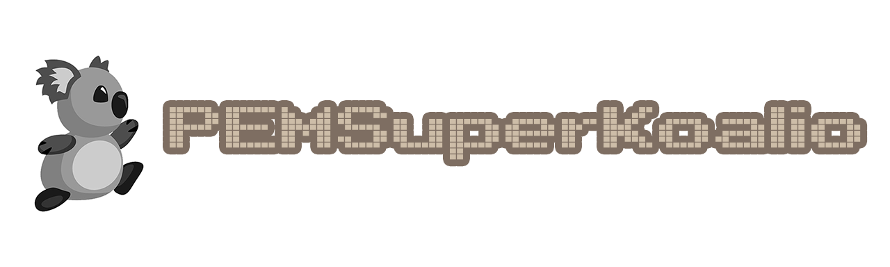

<a href="https://github.com/p-edge-media/PEMSuperKoalio">

**PEMSuperKoalio** is a Swift 5 version of Ray Wenderlichs SpriteKit [SuperKoalio game][superkoalio-url]. It uses the [PEMTileMap][pemtilemap-url] framework to generate the game map and supports iOS, macOS and tvOS.

The SuperKoalio demo project helped me to get into games programming. It was originally made in Objective-C with the `Cocos2D` framework and later a `SpriteKit` version ws made. I decided to make a Swift version that uses [PEMTileMap][pemtilemap-url] instead of `JSTileMap` for the map generation.

The map format used is still the original TMX Map file. [TMX Map files][tmx-map-url] can be created and edited with [Tiled][tiled-url].

This project is intended as educational, expanding upon Ray Wenderlichs original tutorial and code.

## PEMSuperKoalio Game Features
- [ ] load map using the `PEMTmxMap` framework
- [ ] spawn player on the map
- [ ] collision detection
- [ ] level completed, load next map
- [ ] game over
- [ ] sound & music with Audio Unit effects
- [ ] input: touch screen control
- [ ] input: keyboard and mouse
- [ ] input: Apple TV remote controller
- [ ] input: external game controllers
  
## License
Licensed under the [MIT license](license.md).

[tmx-map-url]:https://doc.mapeditor.org/en/stable/reference/tmx-map-format/#
[tiled-url]:http://www.mapeditor.org
[pemtilemap-url]:https://github.com/hotdogsoup-nl/PEMTileMap
[superkoalio-url]:https://www.raywenderlich.com/2554-sprite-kit-tutorial-how-to-make-a-platform-game-like-super-mario-brothers-part-1
